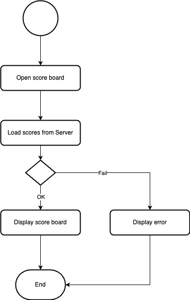
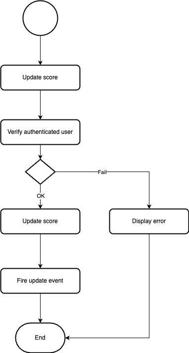

# Problem
Problem 6: Architecture

## Problem Description

We need to create a website that displays the top 10 users' scores on a live-updating scoreboard. An authorized user can update scores, and the scoreboard will reflect the latest scores accordingly.

## Solution Overview

Based on the requirements, we should have these main components:

### Backend service APIs:

1. **Get Scores API**: A public API that allows anyone to retrieve data. It will return the top 10 users' scores.
2. **Update Score API**: A private API that requires a JWT access token in the headers. Only authenticated users can access this API; otherwise, an error should be returned. Updating a score will trigger a notification to all connected WebSocket clients to fetch the latest scores from the server.
3. **Login API**: Provides a basic login method, allowing users to authenticate and obtain their JWT access token.

### Database

- The database will store user information and scores to support the APIs.


## Working flows

### Top 10 user's scores flow



### Update score flow



## API Specifications

### 1. Get the top 10 user's scores

- **Method**: `GET`
- **Endpoint**: `/api/scores`
- **Description**: Returns the current top 10 users' scores.
- **Authentication**: Not required
- **Response Format**: Returns an array containing the top 10 users' scores or an empty array if no scores are available.

```json
[
  { "id": 1, "username": "user 1", "score": 1234 },
  { "id": 2, "username": "user 2", "score": 1233 },
  { "id": 3, "username": "user 2", "score": 1232 },
]
```

- **Errors**:
  - HTTP 500: Internal server error

```json
{
  "error_code": "unknown_error",
  "message": "Unknown error. Please contact the administrator for more details."
}
```

### 2. Update score

- **Method**: `POST`
- **Endpoint**: `/api/scores/{user-id}`
- **Description**: Updates the score for the specified user ID.
- **Authentication**: Requires a Bearer JWT access token.
- **Request Body Payload**:

```json
{
  "score": 100
}
```

- **Response**: Not required.

- **Errors**:
  - HTTP 401: Unauthorized (Unauthenticated error)

  ```json
  {
    "error_code": "unauthenticated",
    "message": "Unauthorized"
  }
  ```
  - HTTP 401: Expired token error

  ```json
  {
    "error_code": "expired",
    "message": "Access token has expired."
  }
  ```
  - HTTP 400: User not found

  ```json
  {
    "error_code": "not_found",
    "message": "User not found."
  }
  ```
  - HTTP 500: Internal server error

  ```json
  {
    "error_code": "unknown_error",
    "message": "Unknown error. Please contact the administrator for more details."
  }
  ```

### 2. Login

- **Method**: `POST`
- **Endpoint**: `/api/login`
- **Description**: Authenticates the user and returns a JWT access token.
- **Authentication**: Not required
- **Request Form Data**:
  - `username`: e.g., "user1"
  - `password`: e.g., "password1"

- **Response Format**:

```json
{
  "access_token": "<JWT key>"
}
```

- **Errors**:
  - HTTP 400: Incorrect username or password

  ```json
  {
    "error_code": "bad_request",
    "message": "Incorrect username or password."
  }
  ```
  - HTTP 500: Internal server error

  ```json
  {
    "error_code": "unknown_error",
    "message": "Unknown error. Please contact the administrator for more details."
  }
  ```

## Potential Improvements

- **Redis Cache**: Store and load the top 10 users' scores from Redis to enhance performance.

Thank you!
